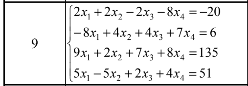
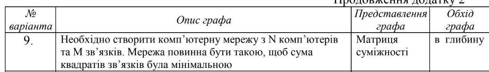
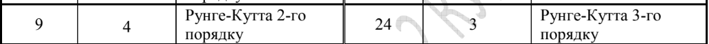

# ДОМАШНЯ РОБОТА

## Мета роботи

– дослідження методів та алгоритмів для вирішення систем лінійних
алгебраїчних рівнянь (СЛАР);
– дослідження способів представлення такої структури даних як «Граф»,
алгоритмів її обробки та набуття практичних навичок із розв’язання задач на
графах;
– дослідження методів вирішення диференційних рівнянь n-порядку та
набуття практичних навичок із розв’язання інженерних задач.

## Завдання

Завдання складається з завдань двох рівнів складності. Номер варіанту
обирається як порядковий номер студента у списку групи, але обов’язково
погоджується з викладачем.
Завдання другого рівня складності має варіативність, тобто студент може
обрати для вирішення або диференційне рівняння, або обробку графів.

## Завдання першого рівня

Написати програму на мові Java, яка вирішує методом LUP-розкладання
СЛАР згідно варіанту (додаток 1, табл. 1.1).

## Завдання другого рівня

Побудувати граф згідно опису, наведеному у додатку 2 (табл. 2.1, кол. 2).
Написати програму на мові Java, яка реалізує побудований граф та виконує його
обхід згідно варіанту (додаток 2, табл. 2.1, кол.2, 3).

або

Написати програму на мові Java, яка вирішує будь-яке диференційне
рівняння n-го порядку методом згідно варіанту (додаток 3, табл. 3.1).

## Методичні рекомендації

Початкові дані для виконання завдання першого рівня (коефіцієнти при
змінних та права частина рівняння) необхідно вводити набором з клавіатури.
Для демонстрації результатів виконання завдання першого рівня слід перед
виведенням розв’язку вивести задану систему лінійних алгебраїчних рівнянь, L –
одиничну нижню-трикутну матрицю, U – верхню-трикутну матрицю, P –
матрицю перестановки.
При виконанні завдання другого рівня з графами: побудований граф
необхідно навести в пояснювальній записці до домашньої роботи. Для перевірки
правильності представлення побудованого графа необхідно вивести його на екран

в залежності від типу представлення. Перед виконанням обходу графа необхідно
ввести з клавіатури вершину, з якої почнеться обхід.
При виконанні завдання другого рівня з диференціальним рівнянням:
результати обчислення слід виводити у табличному вигляді (тобто зберігати
значення функції на кожному кроці розрахунків), а потім побудувати і навести у
пояснювальній записці графік залежності зміни функції від часу.

