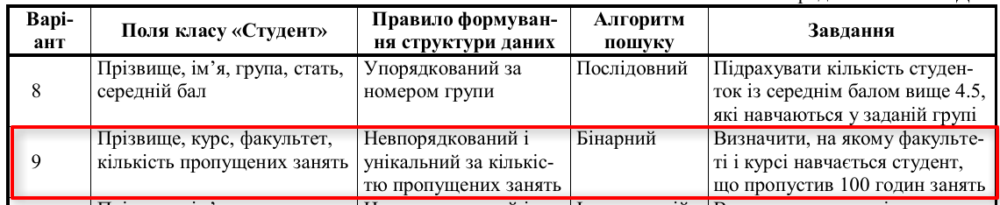

# ЛАБОРАТОРНА РОБОТА 1.5

## ДОСЛІДЖЕННЯ АЛГОРИТМІВ ПОШУКУ

## Варіант 9

**Мета** – дослідити алгоритми пошуку та набути практичних
навичок з пошуку елементів у лінійних та нелінійних структурах
даних.

### Завдання першого рівня

Виконати такі дії:
– описати студента згідно з варіантом завдання (дod. 5, табл.
Д5.1, «Поля класу «Студент»»);
– описати метод, який виконує пошук в одновимірному ма-
сиві студентів за заданим алгоритмом згідно з варіантом завдання
(дод. 5, табл. Д5.1, «Алгоритм пошуку»);
– створити та ініціювати екземпляр лінійної структури даних
(одновимірний масив студентів розміром не меншим ніж 20 елеме-
нтів) з урахуванням правила формування (дод. 5, табл. Д5.1, «Пра-
вило формування структури даних»);
– вивести вміст одновимірного масиву;
– виконати завдання (дод. 5, табл. Д5.1, «Завдання»);
– вивести вміст одновимірного масиву в разі його зміни або
результати виконання завдання.

### Завдання другого рівня

Виконати такі дії:
– описати структуру даних BST-дерева. Тип вузлів BST-
дерева обирати згідно з варіантом завдання (дод. 5, табл. Д5.1,
«Поля класу «Студент»»);
– увести в опис BST-дерева такі методи: додавання вузла, що
використовує поле-ключ згідно з варіантом завдання (дод. 5, табл.
Д5.2, «Поле-ключ»); реалізації операцій «ротація-вліво» і «ротація-
вправо»; пошуку за заданим ключем;
– створити та ініціювати екземпляр BST-дерева;
– знайти та вивести вузол за заданим ключем.

### Завдання третього рівня

Виконати такі дії:
– змінити метод додавання нового вузла у BST-дерево, засто-
совуючи метод балансування згідно з варіантом завдання (дод. 5,
табл. Д5.3);
– створити та ініціювати екземпляр BST-дерева;
– знайти та вивести вузол за заданим ключем.

### Методичні рекомендації

Виконуючи завдання першого рівня, потрібно передбачити
додатковий метод сортування одновимірного масиву в разі викори-
стання бінарного або інтерполяційного алгоритмів пошуку. Алго-
ритм сортування обирається довільно.
При виконанні завдання першого рівня правило формування
структури даних застосовується при додаванні нового елемента під
час ініціювання одновимірного масиву. Упорядкованість потребує
застосування послідовного пошуку для визначення місця розташу-
вання елемента в масиві.
Метод пошуку повертає посилання на об’єкт, що відповідає
критерію пошуку, або значення null у разі неуспішного пошуку.
Якщо в завданні необхідно знайти кількість елементів, що відпові-
дають критерію пошуку, то метод пошуку повертає від’ємне зна-
чення.

Дод5.1

Дод5.2
Прізвище

Дод5.3
Рандомізація
