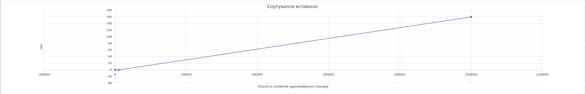
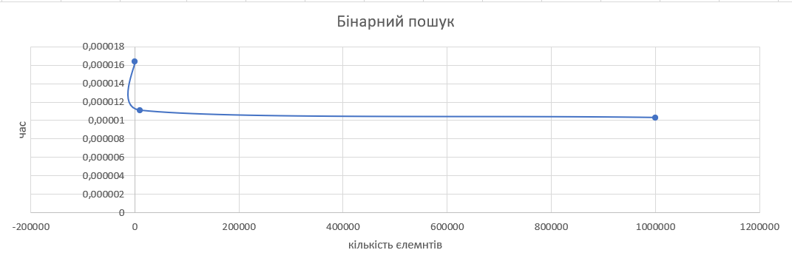
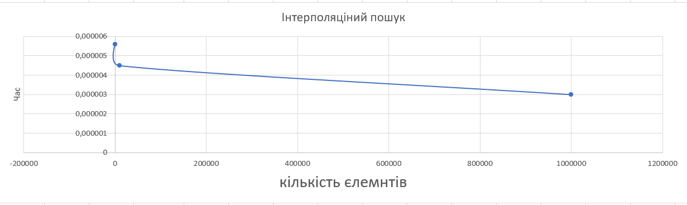
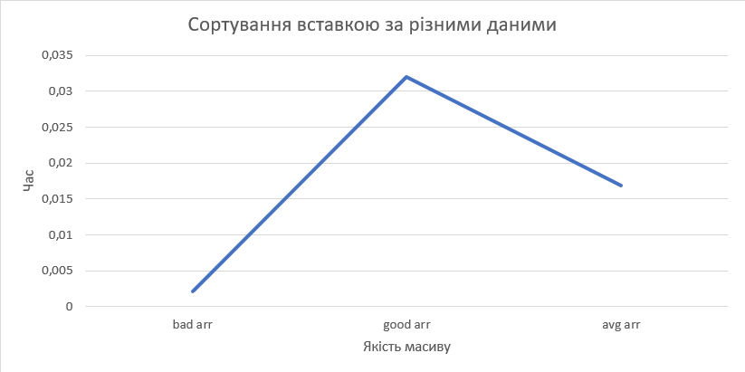
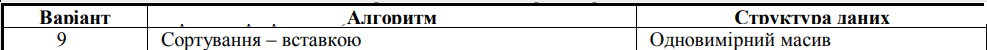
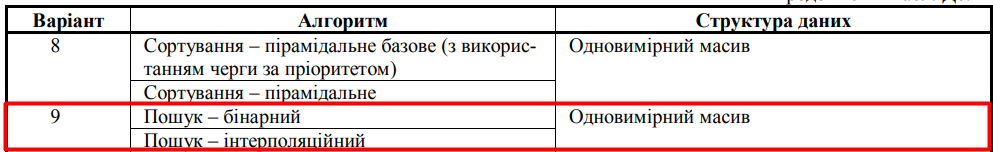

# ЛАБОРАТОРНА РОБОТА 1.6

## ДОСЛІДЖЕННЯ МЕТОДІВ АНАЛІЗУ АЛГОРИТМІВ

## Варіант 9

**Мета** – дослідження методів аналізу ефективності алгоритмів
та набуття практичних навичок з емпіричного дослідження швидкодії алгоритмів залежно від обсягу та структурованості вхідних
даних.

**Завдання першого рівня**
Виконати такі дії:
– реалізувати заданий алгоритм (дод. 6, табл. Д6.1, «Алгоритм») для заданого набору даних (дод. 6, табл. Д6.1, «Структура
даних»);
– визначити час виконання алгоритму для наборів даних розміром N^1, N^2, N^3, де N = 100;
– побудувати графік залежностей часу виконання алгоритму
від кількості елементів набору даних.

**Завдання другого рівня**
Виконати такі дії:
– реалізувати два алгоритми для одного набору (дод. 6, табл.
Д6.2, варіанти 1–5, 7–11, 13, 15–17, 19, 20) або один алгоритм для
двох наборів даних (дод. 6, табл. Д6.2, варіанти 6, 12, 14, 16, 18);
– отримати час виконання алгоритмів для наборів даних розміром N, N^2, N^3, де N = 100;
– побудувати графіки залежностей часу виконання від кількості елементів набору даних для двох реалізацій алгоритму
(дод. 6, табл. Д6.2, варіанти 1–5, 7–11, 13, 15–17, 19, 20) або двох
наборів даних (дод. 6, табл. Д6.2, варіанти 6, 12, 14, 16, 18).

**Завдання третього рівня**
Виконати такі дії:
– визначити, послідовність розташування елементів у наборах даних дає найменший та найбільший час виконання реалізованих алгоритмів;
– сформувати набори даних розміром 10000 елементів, які
розташовані у послідовності, що відповідає найменшому, найбільшому та середньому часу виконання;
– визначити час виконання алгоритмів для сформованих наборів даних;
– побудувати графіки залежностей часу виконання від послідовності розташування елементів набору даних.

**Методичні рекомендації**
Набори даних різного обсягу, необхідні для виконання завдання, слід формувати за допомогою програмного генератора
випадкових чисел (метод public static double random() класу
java.lang.Math або методами класу java.util.Random).
Потрібно звернути увагу, що під час дослідження двох алгоритмів на одній структурі даних набір початкових даних має бути
однаковим.
Час виконання алгоритму обчислюють замірами поточного
часу перед початком роботи алгоритму та після її закінчення (метод public static long nanoTime() класу java.lang.System).
Значення часу виконання алгоритмів, що застосовуватиметься для побудови графіків залежностей, обчислюється як усереднене
значення виконання алгоритму в наносекундах. Графіки залежностей будуються з використанням програмного застосування
Microsoft Excel. Для того щоб порівняти час виконання алгоритмів
у завданні другого та третього рівнів, графіки залежностей слід
розмістити в одній координатній площині.

Дод 6.1

Дод 6.2

## Контрольні запитання

Ось структурований варіант відповідей з використанням Markdown для зручного читання та навігації.

### 1. Як визначається поняття «алгоритм»? Які його властивості?

**Алгоритм** — це точний і зрозумілий набір інструкцій, що задає послідовність дій, спрямованих на розв'язання певного завдання або досягнення мети за скінченну кількість кроків.

**Основні властивості:**

* **Дискретність:** розбиття процесу на окремі елементарні кроки.
* **Детермінованість:** кожен крок є однозначним і не допускає подвійного тлумачення.
* **Скінченність:** алгоритм має обов'язково завершуватися після певної кількості кроків.
* **Результативність:** завжди призводить до отримання результату або повідомлення про неможливість його отримання.
* **Масовість:** здатність розв'язувати цілий клас однотипних задач із різними вхідними даними.

---

### 2. Які є види алгоритмів та як підтверджується правильність алгоритму?

**Види алгоритмів за структурою:**

* **Лінійні:** дії виконуються строго послідовно.
* **Розгалужені:** вибір шляху виконання залежить від певної умови.
* **Циклічні:** дії повторюються задану кількість разів або до виконання умови.

**Види за парадигмою проектування:**

* «Розділяй і володарюй».
* Жадібні алгоритми.
* Динамічне програмування.
* Алгоритми з поверненням (бектрекінг).

**Підтвердження правильності:**
Здійснюється шляхом **математичного доведення** (через інваріанти циклу або математичну індукцію), а також через **емпіричне тестування** на різних наборах даних, особливо на граничних випадках (порожні масиви, вже відсортовані дані тощо).

---

### 3. Що розуміють під сортуванням? Які є властивості у сортування? Класифікація?

**Сортування** — це процес впорядкування елементів у структурі даних за певною ознакою (ключем) у порядку зростання чи спадання.

**Властивості сортування:**

* **Стійкість (Stability):** збереження початкового відносного порядку елементів з однаковими ключами.
* **Природність (Адаптивність):** здатність алгоритму працювати швидше на вже частково відсортованих даних.
* **Витрати пам'яті:** сортування «на місці» ($O(1)$ додаткової пам'яті) або з виділенням додаткових масивів.

**Класифікація:**

* За часовою складністю ($O(N^2)$, $O(N \log N)$, $O(N)$).
* За методом: вставка, обмін, вибір, злиття, розподіл.

---

### 4. Сутність алгоритмів групи елементарного сортування

Ці алгоритми мають квадратичну складність $O(N^2)$ і підходять для невеликих масивів:

* **Сортування вибіркою:** послідовно знаходить найменший елемент у невідсортованій частині і міняє його місцями з першим невідсортованим елементом.
* **Сортування вставкою:** бере наступний елемент і вставляє його на правильну позицію у вже відсортованій частині шляхом зсуву більших елементів.
* **Сортування бульбашкою:** багаторазово проходить масивом, міняючи місцями неправильно розташовані сусідні елементи (найбільші «спливають» у кінець).
* **Двоспрямована бульбашка (шейкерне):** чергує проходи зліва направо і справа наліво, що допомагає швидше переміщувати малі елементи в початок.

---

### 5. Сутність алгоритмів групи «швидкого» сортування

Базуються на принципі «розділяй і володарюй».
**Сутність:** Обирається **опорний елемент** (pivot). Масив перерозподіляється так, щоб усі менші елементи опинилися зліва від опорного, а більші — справа. Далі процес рекурсивно повторюється для лівої та правої частин.

**Відмінності (модифікації):**

* **Вибір опорного елемента:** перший, останній, центральний, випадковий або медіана. Це впливає на ризик виникнення найгіршого випадку $O(N^2)$.
* **Схеми розбиття:** схема Ломуто (один вказівник) або схема Гоара (два зустрічні вказівники).

---

### 6. Черга за пріоритетом: структура та особливості

**Черга за пріоритетом** — це абстрактна структура даних, де кожен елемент має асоційований пріоритет. Елементи з найвищим пріоритетом вилучаються першими, незалежно від часу їх додавання.

**Особливості реалізації:**
Для забезпечення логарифмічного часу $O(\log N)$ на вставку та вилучення, ця черга найчастіше реалізується на базі структури **бінарна купа** (binary heap), яка фізично компактно зберігається у звичайному одновимірному масиві.

---

### 7. Сортування Шелла: сутність та вибір кроку

**Сутність:** Це оптимізоване сортування вставкою. Замість порівняння сусідніх елементів, воно порівнює елементи, що знаходяться на певній відстані (**кроці**) один від одного. Після кожного проходу крок зменшується до 1, завершуючись звичайним сортуванням вставкою на вже майже впорядкованому масиві.

**Вибір кроку:**

* **Класична (Шелла):** ділення розміру масиву навпіл ($N/2$, $N/4$, ..., 1).
* **Оптимізовані послідовності:** Гіббарда, Седжвіка, Пратта — вони використовують спеціальні математичні формули для обчислення кроку, що дозволяє уникнути найгірших випадків і знизити складність.

---

### 8. Елементарне сортування за індексами (розподілений підрахунок)

**Сутність:** Алгоритм не використовує операції порівняння. Він підраховує кількість входжень кожного унікального значення з масиву у спеціальний **допоміжний масив частот** (де індексом виступає саме значення). На основі частот обчислюється префіксна сума, яка вказує на точну фінальну позицію кожного елемента у відсортованому масиві. Дуже швидкий $O(N)$, але вимагає пам'яті, пропорційної діапазону чисел.

---

### 9. Кишенькове сортування (Bucket Sort)

**Сутність:** Елементи масиву розподіляються у скінченну кількість «кишень» (відер) на основі їхнього значення. Далі кожна кишеня сортується окремо (зазвичай сортуванням вставкою), після чого відсортовані елементи послідовно зливаються назад в один масив.

**Способи реалізації:**

* Використання хеш-функції для визначення, в яку кишеню потрапить елемент.
* Самі кишені можуть бути реалізовані як зв'язні списки або динамічні масиви.

---

### 10. Порозрядне сортування (Radix Sort)

**Сутність:** Ключі розглядаються не як цілі числа, а як послідовності розрядів (цифр або символів). Сортування відбувається послідовно за кожним розрядом із використанням стабільного алгоритму (наприклад, сортування підрахунком).

**Різновиди:**

* **LSD (Least Significant Digit):** сортування починається з найменш значущого розряду (з кінця, від одиниць до десятків і сотень). Класичний підхід для чисел.
* **MSD (Most Significant Digit):** сортування починається з найбільш значущого розряду (з початку). Часто використовується для лексикографічного сортування рядків.

---

### 11. Сортування злиттям (Merge Sort)

**Сутність:** Масив розбивається навпіл, доки не утворяться одиничні (відсортовані) підмасиви. Після цього сусідні підмасиви попарно зливаються у більші відсортовані блоки, доки не утвориться фінальний масив. Гарантована складність $O(N \log N)$.

**Чим відрізняються:**

* **Низхідне злиття (Top-Down):** використовує рекурсію для розбиття масиву зверху вниз.
* **Висхідне злиття (Bottom-Up):** працює ітеративно (у циклі), одразу починаючи злиття пар елементів, потім четвірок, вісімок тощо, не використовуючи стек викликів.

---

### 12. Підтримка коректної структури «черги за пріоритетом»

Для збереження властивостей бінарної купи використовуються дві основні операції:

* **Просіювання вгору (Sift Up):** застосовується при додаванні елемента. Новий елемент ставиться в кінець масиву і піднімається вгору (міняється місцями з батьком), доки не стане меншим за батька (або не досягне кореня).
* **Просіювання вниз (Sift Down):** застосовується при вилученні кореня. На місце вилученого кореня ставиться останній елемент купи, після чого він опускається вниз (міняється місцями з найбільшим нащадком), доки не опиниться на правильній позиції.

---

### 13. Пірамідальне сортування (Heap Sort)

**Сутність:** Невідсортований масив спочатку перетворюється на бінарну купу (найбільший елемент опиняється в корені на індексі 0). Далі корінь міняється місцями з останнім елементом масиву, віртуальний розмір купи зменшується на 1, і для нового (неправильного) кореня викликається операція «просіювання вниз». Процес повторюється, доки купа не спорожніє.

**Чим відрізняються реалізації:**

* Побудова **Max-Heap** (сортування за зростанням) або **Min-Heap** (сортування за спаданням).
* Внутрішні оптимізації циклів і методів розрахунку індексів батьків та нащадків.
